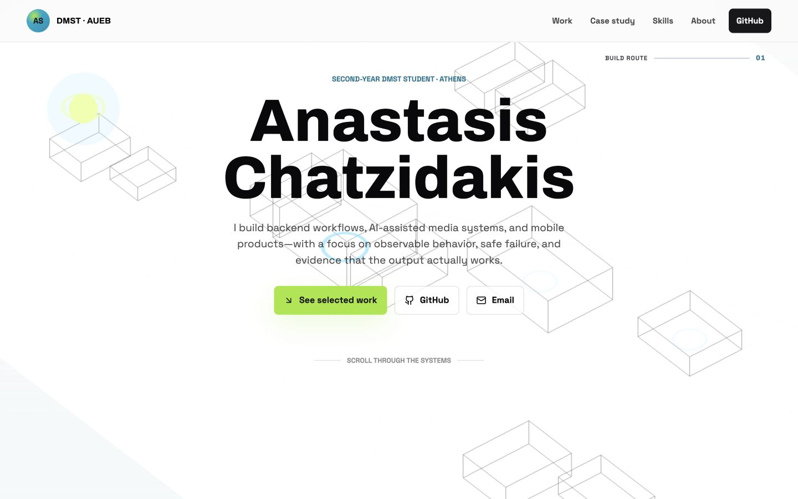

# Anastasis Chatzidakis · Engineering Portfolio

A static, responsive portfolio for internship and junior engineering applications. It presents selected public work through problems, technical decisions, implementation status, and verifiable evidence rather than a badge wall.



**Live site:** [anaschatz.github.io/my-portfolio](https://anaschatz.github.io/my-portfolio/)

## Positioning

Anastasis is a third-year Management Science and Technology student at the Athens University of Economics and Business, focused on backend workflows, AI-assisted media systems, and mobile products.

The flagship case study is [ShortsEngine](https://github.com/anaschatz/Shorts-Engine), an evidence-gated vertical-video production prototype. The case study intentionally distinguishes the current local/SQLite runtime from PostgreSQL, distributed worker, managed object-storage, and durable cost-telemetry milestones that are designed but not yet production-proven.

## Selected projects

| Project                                                     | Scope                                                                                      | Current status                    |
| ----------------------------------------------------------- | ------------------------------------------------------------------------------------------ | --------------------------------- |
| [ShortsEngine](https://github.com/anaschatz/Shorts-Engine)  | Node.js/Python media workflows, FFmpeg rendering, job lifecycle, rendered QA, human review | Production-hardening prototype    |
| [Gym App](https://github.com/anaschatz/gym-app)             | Local-first React Native workout, nutrition, bodyweight, and progress tracking             | Working local-first app           |
| [FinDet](https://github.com/anaschatz/FinDet)               | JavaFX and SQLite Greek State Budget analysis                                              | Completed team coursework project |
| [Budgeting App](https://github.com/anaschatz/budgeting-app) | Modular Swift personal-finance architecture with Core Data, OCR, security, and tests       | Active prototype                  |

Project cards are generated from [`assets/project-data.js`](assets/project-data.js). Rendering and validation live in [`assets/project-renderer.js`](assets/project-renderer.js), including a readable fallback for missing or invalid data.

## Design and architecture

- Semantic HTML, modern CSS, and small framework-free JavaScript modules.
- The original Three.js + GSAP scroll experience is preserved as the visual anchor.
- Responsive layouts are verified at phone, tablet, and desktop widths.
- Reduced-motion preferences receive a complete static experience.
- Archivo and Space Grotesk are self-hosted to avoid a render-blocking font dependency.
- Local project images are below the fold, lazy-loaded, and decoded asynchronously.
- Open Graph, Twitter Card, canonical metadata, structured data, sitemap, and favicon are included.

## Local development

Requirements: Node.js 22.22.2 or newer.

```bash
npm ci
npm run dev
```

Open [http://127.0.0.1:4173](http://127.0.0.1:4173).

## Quality commands

| Command              | Purpose                                                                                                        |
| -------------------- | -------------------------------------------------------------------------------------------------------------- |
| `npm run format`     | Format source and configuration with Prettier                                                                  |
| `npm run lint`       | Validate HTML, external-link safety, local asset paths, and stale claims                                       |
| `npm run typecheck`  | Run JavaScript syntax checks across source, tests, and scripts                                                 |
| `npm test`           | Run Node/JSDOM tests for structure, navigation, data rendering, invalid-data fallback, and accessible controls |
| `npm run build`      | Produce a verified static build in `dist/`                                                                     |
| `npm run check`      | Run formatting, lint, syntax checks, tests, and build                                                          |
| `npm run lighthouse` | Audit mobile and desktop builds and enforce performance/accessibility/SEO thresholds                           |

The GitHub Actions workflow uses `npm ci` with the committed lockfile, then runs formatting, linting, syntax checks, tests, and the build.

## Verification baseline

Local Lighthouse runs use a mobile profile and the standard desktop network/CPU profile. The current baseline is:

| Profile | Performance | Accessibility | Best practices | SEO |
| ------- | ----------: | ------------: | -------------: | --: |
| Mobile  |         100 |           100 |             96 | 100 |
| Desktop |         100 |           100 |             96 | 100 |

Reports are generated locally under `.lighthouse/` and are intentionally ignored by Git.

## Build and deployment

`npm run build` copies the production-ready static site into `dist/`. The Pages deployment workflow runs the full quality gate, uploads only `dist/`, and deploys it through GitHub Actions.

The repository's GitHub Pages source must be set to **GitHub Actions**. Pushes to `main` deploy automatically, and the workflow can also be started manually with `workflow_dispatch`.

No runtime environment variables or secrets are required.

## Manual settings to review before publishing

- Confirm the public email address in `index.html`.
- Add LinkedIn or résumé actions only when valid public URLs exist; no placeholder links are included.
- Re-check ShortsEngine maturity claims when the runtime moves beyond local/SQLite operation.
- Re-check the YouTube showcase links and recorded provenance before describing a public output as verified pipeline proof.
- Update canonical, Open Graph, sitemap, and `robots.txt` URLs if the deployment domain changes.
- Regenerate `assets/portfolio-preview.png` and `assets/social-preview.png` after major visual changes.

## Repository layout

```text
.
├── .github/workflows/ci.yml
├── assets/
│   ├── app.js
│   ├── project-data.js
│   ├── project-renderer.js
│   ├── styles.css
│   └── fonts/ and portfolio media
├── scripts/
│   ├── build.mjs
│   ├── lighthouse.mjs
│   ├── lint.mjs
│   ├── serve.mjs
│   └── typecheck.mjs
├── tests/portfolio.test.mjs
├── index.html
├── package.json
└── package-lock.json
```
